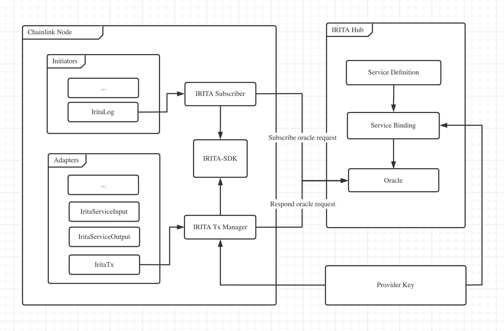
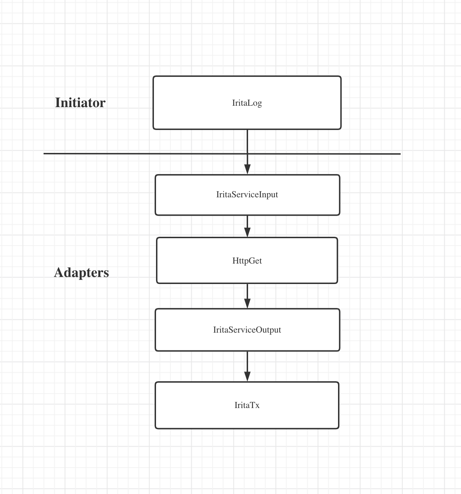

# Chainlink 添加 IRITA 支持

## 结构设计

结构设计



工作流程



### Initiators

**iritalog**

订阅 IRITA Hub 中 service 请求，监听到符合条件的请求时启动 Job。

- `params`
  - `serviceName`：要订阅的服务名
  - `serviceProvider`：要订阅的服务提供方

### Adapters

**IritaServiceInput**

负责解析 oracle 的 input 数据

- `input`：oracle input
- `output`：按照指定 path 从 input 中取得 value
- `params`
  - `pathKey`：从 input 获取 output 数据的路径

**IritaServiceOutput**

- `input`：http 请求返回结果
- `output`：标准的 output 返回格式
- `params`：无（irismod/service v1.2 后会添加非功能性参数）

**IritaTx**

- `input`：IritaServiceOutput 的 output 数据，作为 respond
- `output`：respond 执行结果
- `params`：无

## 工作流程

**1. 配置 provider 在 Irita 上使用的私钥**

示例

```bash
iritacli keys add provider \
    --chain-id=irita-hub \
    --home=~/.chainlink/.iritakeys/ \
    --keyring-backend=file
```

**2. 配置文件中添加 Irita 配置**

示例

```bash
IRITA_URL=http://localhost:26657
IRITA_CHAIN_ID=irita-hub
IRITA_KEY_DAO=~/.chainlink/.iritakeys
IRITA_KEY_NAME=provider
```

**2. 在 Irita-Hub 上创建服务定义**

示例

```bash
iritacli tx service define \
    --name oracle \
    --description="this is a oracle service" \
    --author-description="oracle service provider" \
    --schemas='{"input":{"type":"object"},"output":{"type":"object"}}' \
    --chain-id=irita-hub \
    --from=key-provider \
    --broadcast-mode=block \
    --keyring-backend=file \
    --home=testnet/node0/iritacli \
    -y
```

**3. Provider 绑定服务定义**

示例

```bash
iritacli tx service bind \
    --service-name=oracle \
    --deposit=20000point \
    --pricing='{"price":"1point"}' \
    --qos 1 \
    --chain-id=irita-hub \
    --from=provider \
    --broadcast-mode=block \
    --keyring-backend=file \
    --home=testnet/node0/iritacli \
    -y
```

**4. 在 IRITA Hub 上创建 oracle**

需拥有 PowerUser 权限的账户进行操作。

示例

```bash
# 创建 oracle
iritacli tx oracle create \
    --feed-name="test-feed" \
    --description="test feed" \
    --latest-history=10 \
    --service-name="oracle" \
    --input='{"pair":"ethbtc"}' \
    --providers=iaa14h0g32km06yj2eszf7twuftlj2ntrujvqhxgpc \
    --service-fee-cap=1point \
    --timeout=9 \
    --frequency=10 \
    --threshold=1 \
    --aggregate-func="avg" \
    --value-json-path="last" \
    --chain-id=irita-hub \
    --from=provider \
    --fees=4point \
    --broadcast-mode=block \
    --keyring-backend=file \
    --home=testnet/node0/iritacli \
    -y

# 启动 oracle
iritacli tx oracle start test-feed \
    --chain-id=irita-hub \
    --from=provider \
    --broadcast-mode block \
    --keyring-backend=file \
    --home=testnet/node0/iritacli \
    -y
```

**5. 启动 Chainlink 管理面板，创建 Job**

示例

```bash
{
    "initiators": [
        {
            "type": "iritalog",
            "params": {
                "serviceName": "oracle",
                "serviceProvider": "iaa14h0g32km06yj2eszf7twuftlj2ntrujvqhxgpc"
            }
        }
    ],
    "tasks": [
        {
            "type": "iritaserviceinput",
            "params": {
                "pathKey": "pair"
            }
        },
        {
            "type": "HTTPGet",
            "params": {
                "get": "https://www.bitstamp.net/api/v2/ticker/"
            }
        },
        {
            "type": "iritaserviceoutput"
        },
        {
            "type": "iritatx"
        }
    ]
}
```
